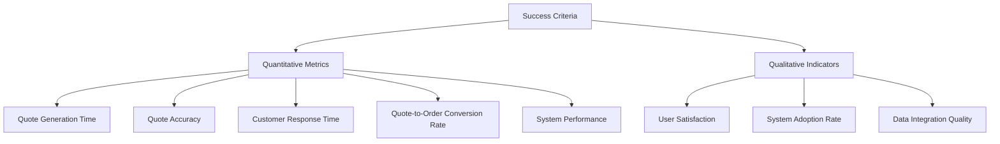
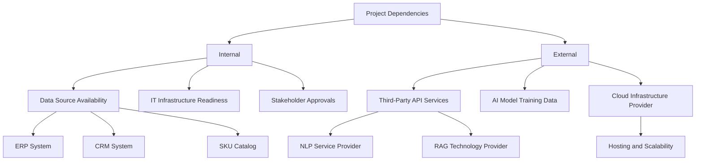
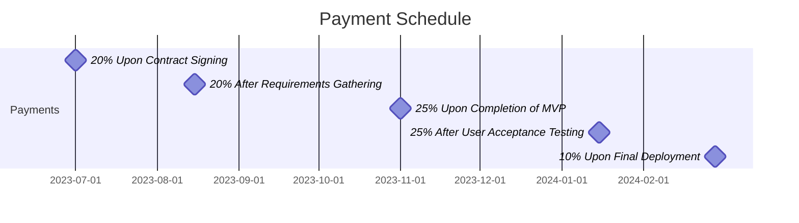
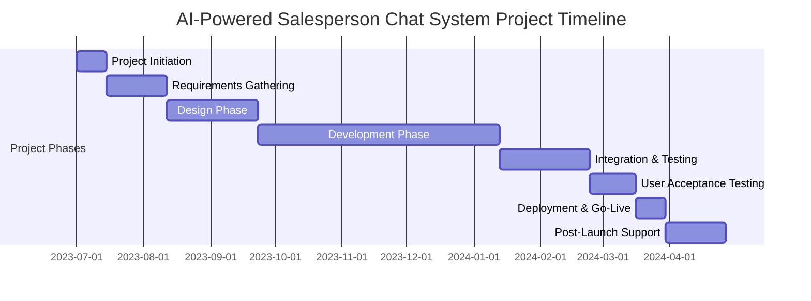
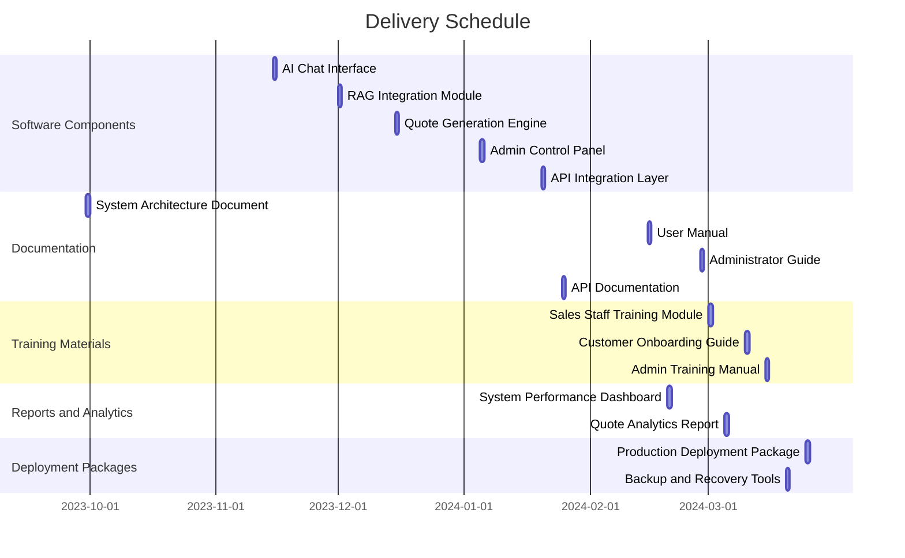

## EXECUTIVE SUMMARY

### PROJECT OVERVIEW

This project aims to develop an AI-powered salesperson chat system for streamlining part quoting and ordering processes. The client faces challenges in efficiently handling customer inquiries, retrieving relevant product information, and generating accurate quotes. Our proposed solution leverages cutting-edge AI technology to address these pain points by offering a natural language interface for requirement ingestion, intelligent data retrieval using Retrieval-Augmented Generation (RAG), and automated quote generation integrated with the company's SKU catalog.

### OBJECTIVES

1. Enhance customer experience by providing an intuitive, conversational interface for part inquiries and quotes
2. Reduce response time for quote generation by automating the process of requirement gathering and data retrieval
3. Improve quote accuracy by leveraging AI to extract precise information from various data sources
4. Increase sales efficiency by enabling both sales representatives and customers to interact directly with the system
5. Streamline internal processes by integrating with existing systems (CRM, ERP) and maintaining audit trails

### VALUE PROPOSITION

Our agency offers a unique combination of expertise and innovation that sets us apart for this project:

1. **AI-Driven Solution**: We specialize in developing advanced AI systems, ensuring a state-of-the-art chat interface that can understand and process complex part requirements.

2. **RAG Technology Integration**: Our proficiency in Retrieval-Augmented Generation allows for intelligent and context-aware data retrieval, significantly enhancing the accuracy and relevance of generated quotes.

3. **Seamless System Integration**: We have a proven track record of integrating AI solutions with existing business systems, ensuring smooth data flow between the new chat system and the client's SKU catalog, CRM, and ERP.

4. **Customization and Scalability**: Our solution is designed to be highly customizable, allowing for easy adaptation to the client's specific needs and future scaling as the business grows.

5. **Data Security and Compliance**: We prioritize data protection and regulatory compliance, implementing robust security measures and maintaining detailed audit trails.

By choosing our agency, the client will benefit from a cutting-edge AI solution that not only addresses their immediate needs but also positions them at the forefront of technological innovation in their industry.

## PROJECT OBJECTIVES

### BUSINESS GOALS

1. Increase Sales Efficiency:
   - Reduce quote generation time by 75%, allowing sales representatives to handle more inquiries
   - Improve quote accuracy to 99%, minimizing errors and rework
   - Enable 24/7 quote generation capability, expanding service availability

2. Enhance Customer Experience:
   - Decrease average response time for customer inquiries by 80%
   - Increase customer satisfaction scores by 30% through faster, more accurate quoting
   - Provide self-service quoting options for customers, reducing dependency on sales staff

3. Optimize Resource Allocation:
   - Reduce manual effort in quote generation by 90%, freeing up sales staff for high-value activities
   - Decrease training time for new sales staff by 50% through AI-assisted quoting

4. Drive Revenue Growth:
   - Increase quote-to-order conversion rate by 25% through faster turnaround and improved accuracy
   - Expand market reach by enabling multilingual quoting capabilities

### TECHNICAL GOALS

1. AI-Powered Natural Language Processing:
   - Implement advanced NLP algorithms to achieve 95% accuracy in understanding customer requirements
   - Develop context-aware prompting system for clarifying vague or incomplete specifications

2. Retrieval-Augmented Generation (RAG) Integration:
   - Integrate RAG technology with internal data sources (ERP, CRM, product catalogs)
   - Achieve 99% accuracy in retrieving relevant product information and pricing data

3. Automated Quote Generation:
   - Develop a robust quote generation engine capable of handling complex, multi-part orders
   - Implement dynamic pricing algorithms that consider bulk discounts and custom pricing rules

4. System Integration:
   - Seamlessly integrate the AI chat system with existing SKU catalog, CRM, and ERP systems
   - Ensure real-time data synchronization between all integrated systems

5. User Interface and Experience:
   - Create an intuitive chat interface accessible to both sales representatives and customers
   - Develop responsive design for cross-platform compatibility (desktop, mobile, tablet)

6. Security and Compliance:
   - Implement end-to-end encryption for all data transmissions
   - Develop comprehensive audit trail and versioning system for quotes

7. Scalability and Performance:
   - Design system architecture to handle 1000+ concurrent users without performance degradation
   - Ensure average response time of less than 2 seconds for quote generation

### SUCCESS CRITERIA

1. Quantitative Metrics:
   - Quote Generation Time: Reduce from current average of 2 hours to 30 minutes or less
   - Quote Accuracy: Achieve 99% accuracy rate in generated quotes
   - Customer Response Time: Decrease average from 24 hours to 2 hours or less
   - Quote-to-Order Conversion Rate: Increase from current 20% to 25% or higher
   - System Performance: Maintain 99.9% uptime and <2 second response time

2. Qualitative Indicators:
   - User Satisfaction: Positive feedback from both sales staff and customers on system usability
   - System Adoption Rate: 90% of sales staff regularly using the AI chat system within 3 months of launch
   - Data Integration Quality: Seamless flow of information between AI chat system and existing business systems

3. Project Milestones:
   - Successful completion of all project phases within agreed timelines
   - Smooth transition to production environment with minimal disruption to existing operations
   - Completion of user training programs with high satisfaction scores

4. Financial Metrics:
   - Return on Investment (ROI): Achieve positive ROI within 18 months of system deployment
   - Cost Savings: Reduce operational costs related to quote generation by 40% within the first year

5. Compliance and Security:
   - Pass all required security audits and compliance checks
   - Zero data breaches or unauthorized access incidents during the first year of operation

These success criteria will be continuously monitored and evaluated throughout the project lifecycle to ensure the AI-powered salesperson chat system meets both business and technical objectives.

## SCOPE OF WORK

### IN-SCOPE

1. AI-Powered Chat Interface
   - Natural language processing for requirement ingestion
   - Interactive prompts for missing information
   - Autonomous questioning for clarification

2. Retrieval-Augmented Generation (RAG) Integration
   - Integration with internal data sources (ERP, CRM, product catalogs)
   - Customizable data source prioritization
   - Dimension extraction from drawings and input files

3. Quote Generation System
   - SKU catalog integration
   - Dynamic pricing engine
   - Bulk order discount calculations
   - Integration with existing costing tool
   - Multi-part quote consolidation

4. Structured Output Generation
   - Formatted quote creation
   - Export options (PDF, CSV, email)

5. User Management
   - Role-based access for salespeople and customers
   - CRM integration for quote logging

6. Versioning and Auditing
   - Quote revision tracking
   - Comprehensive audit trail system

7. Customizable Rules and Filters
   - Admin controls for AI behavior configuration
   - Custom filters for SKU mapping

8. System Integration
   - Integration with existing SKU catalog
   - CRM system integration
   - ERP system integration

9. User Training and Documentation
   - Training sessions for sales staff and administrators
   - User manuals and online help resources

10. Security and Compliance
    - End-to-end encryption implementation
    - Compliance with industry standards and regulations

### OUT-OF-SCOPE

1. Hardware procurement or upgrades
2. Modifications to existing ERP or CRM systems beyond integration points
3. Custom mobile applications (system will be web-based with responsive design)
4. Integration with external marketplaces or e-commerce platforms
5. Automated order placement or payment processing
6. Physical inventory management or warehouse systems
7. Customer support chatbot functionality unrelated to quoting
8. Multi-language support (initial implementation will be in English only)
9. Advanced analytics or business intelligence reporting
10. Integration with CAD/CAM systems for direct part design input

### ASSUMPTIONS

1. Client will provide access to necessary internal systems (ERP, CRM, SKU catalog) for integration
2. Existing data sources are well-structured and contain accurate, up-to-date information
3. Client will assign a dedicated project manager as a point of contact
4. Client's IT infrastructure can support the new system without major upgrades
5. End-users (sales staff and customers) have basic computer literacy and internet access
6. Client will provide sample data for testing and training the AI system
7. Necessary approvals for system implementation will be obtained in a timely manner
8. Client's existing systems have APIs or other integration points available
9. Client will handle any necessary data cleansing or preparation before system integration
10. The project will follow an agile development methodology with regular client feedback

### DEPENDENCIES

1. Internal Dependencies:
   - Availability and quality of data from ERP, CRM, and SKU catalog systems
   - IT infrastructure readiness for new system deployment
   - Timely stakeholder approvals for key project milestones
   - Allocation of client resources for testing and feedback
   - Completion of data preparation and cleansing activities

2. External Dependencies:
   - Availability and performance of third-party API services for NLP and RAG technologies
   - Procurement of necessary AI model training data
   - Cloud infrastructure provider's service reliability and scalability
   - Timely delivery of any licensed software components
   - Compliance with evolving data protection regulations

3. Technical Dependencies:
   - Successful integration with existing SKU catalog system
   - Compatibility of AI models with client's data structure
   - Performance of RAG technology with client's specific data sources
   - Scalability of the system to handle projected user load

4. Timeline Dependencies:
   - Completion of user acceptance testing before final deployment
   - Scheduling of user training sessions
   - Coordination with client's IT department for system rollout
   - Alignment with client's business cycles for minimal disruption

## BUDGET AND COST ESTIMATES

### COST BREAKDOWN

The following table provides a detailed breakdown of the project costs:

| Category | Description | Cost (USD) |
|----------|-------------|------------|
| Labor | AI Development Team (1600 hours @ $150/hr) | 240,000 |
| | UI/UX Design (400 hours @ $120/hr) | 48,000 |
| | System Integration Specialists (600 hours @ $140/hr) | 84,000 |
| | Project Management (400 hours @ $130/hr) | 52,000 |
| | Quality Assurance (400 hours @ $100/hr) | 40,000 |
| Software Licenses | NLP and RAG Technology Licenses | 75,000 |
| | Cloud Infrastructure (Annual) | 60,000 |
| Hardware | Development and Testing Servers | 20,000 |
| Training | Staff Training and Documentation | 25,000 |
| Contingency | 10% of total project cost | 64,400 |
| **Total** | | **708,400** |

### PAYMENT SCHEDULE

The proposed payment schedule is tied to project milestones and deliverables:

1. 20% ($141,680) upon contract signing
2. 20% ($141,680) after completion of requirements gathering and project planning phase
3. 25% ($177,100) upon delivery of Minimum Viable Product (MVP)
4. 25% ($177,100) after successful completion of User Acceptance Testing
5. 10% ($70,840) upon final deployment and project closure

### BUDGET CONSIDERATIONS

Several factors could potentially impact the budget:

1. **Scope Creep**: 
   - Risk: Additional features or changes in requirements may increase development time and costs.
   - Mitigation: Implement strict change control procedures and clearly define the project scope in the contract.

2. **Integration Complexity**:
   - Risk: Unforeseen complications in integrating with existing systems could extend the project timeline.
   - Mitigation: Conduct thorough system analysis during the initial phase and allocate additional buffer time for integration tasks.

3. **Data Quality and Preparation**:
   - Risk: Poor data quality in existing systems may require additional cleansing and preparation efforts.
   - Mitigation: Include a data assessment phase early in the project and budget for potential data cleansing activities.

4. **AI Model Training**:
   - Risk: The AI model may require more extensive training data or iterations than initially estimated.
   - Mitigation: Plan for multiple training cycles and potentially budget for additional data acquisition if needed.

5. **Regulatory Compliance**:
   - Risk: Changes in data protection regulations may require additional security measures.
   - Mitigation: Stay informed about relevant regulations and include a compliance review phase in the project plan.

6. **Third-Party Service Costs**:
   - Risk: Prices for cloud services or AI technologies may fluctuate.
   - Mitigation: Negotiate long-term contracts with service providers and include price protection clauses where possible.

7. **Performance Optimization**:
   - Risk: Additional resources may be required to meet performance benchmarks.
   - Mitigation: Include performance testing early in the development cycle and budget for potential infrastructure upgrades.

To manage these uncertainties:

- Maintain open communication with the client about potential budget impacts.
- Conduct regular risk assessments throughout the project lifecycle.
- Utilize the 10% contingency fund for unforeseen expenses.
- Implement a change request process with associated cost implications for any scope changes.
- Conduct monthly budget reviews to track expenses against projections and adjust as necessary.

By carefully monitoring these considerations and implementing proactive mitigation strategies, we aim to deliver the project within the proposed budget while maintaining flexibility to address unforeseen challenges.

## TIMELINE AND MILESTONES

### PROJECT TIMELINE

The following Gantt chart outlines the major phases of the project, from initiation to completion:

### KEY MILESTONES

| Milestone | Description | Target Date |
|-----------|-------------|-------------|
| M1: Project Kickoff | Project charter approved, team assembled | 2023-07-01 |
| M2: Requirements Sign-off | Detailed requirements document approved | 2023-08-11 |
| M3: Design Approval | System architecture and UI/UX designs finalized | 2023-09-22 |
| M4: MVP Release | Core functionality developed and ready for testing | 2023-12-15 |
| M5: Integration Complete | All system integrations (SKU catalog, CRM, ERP) functional | 2024-01-12 |
| M6: UAT Sign-off | User Acceptance Testing completed and approved | 2024-03-15 |
| M7: Go-Live | System deployed to production environment | 2024-03-29 |
| M8: Project Closure | Post-launch support completed, project formally closed | 2024-04-26 |

### CRITICAL PATH

The following tasks represent the critical path for the project. Any delays in these activities will directly impact the project timeline:

1. Requirements Gathering and Sign-off
   - Crucial for defining the scope and functionality of the system
   - Delays here will push back all subsequent phases

2. AI Model Development and Training
   - Core component of the system's functionality
   - Requires significant time and iterations for optimal performance

3. RAG Technology Integration
   - Essential for accurate data retrieval and context-aware responses
   - Complex integration that affects multiple system components

4. SKU Catalog and Pricing Engine Integration
   - Critical for generating accurate quotes
   - Requires careful synchronization with existing systems

5. User Acceptance Testing (UAT)
   - Final validation of system functionality and usability
   - Any issues discovered here could require significant rework

6. Data Migration and System Cutover
   - Transition from existing quoting process to the new AI-powered system
   - Requires careful planning to minimize business disruption

To manage the critical path effectively:

- Allocate additional resources to these tasks when possible
- Implement rigorous progress monitoring and reporting
- Establish clear communication channels for quick issue resolution
- Consider parallel development tracks where feasible to optimize timeline
- Plan for contingencies and have mitigation strategies ready for potential delays

By focusing on these critical path items and maintaining flexibility in resource allocation, we aim to keep the project on schedule and deliver the AI-powered salesperson chat system within the proposed timeline.

## DELIVERABLES

### LIST OF DELIVERABLES

The following table provides a comprehensive list of all tangible outputs for the AI-powered salesperson chat system project:

| Category | Deliverable | Description |
|----------|-------------|-------------|
| Software Components | AI Chat Interface | Web-based chat interface for requirement ingestion |
| | RAG Integration Module | System component for retrieving and processing internal data |
| | Quote Generation Engine | Core system for creating accurate, dynamic quotes |
| | Admin Control Panel | Interface for system configuration and management |
| | API Integration Layer | Components for connecting with SKU catalog, CRM, and ERP |
| Documentation | System Architecture Document | Detailed technical documentation of system design |
| | User Manual | Comprehensive guide for sales staff and customers |
| | Administrator Guide | Technical guide for system maintenance and configuration |
| | API Documentation | Detailed documentation for all system APIs |
| Training Materials | Sales Staff Training Module | Interactive e-learning course for sales representatives |
| | Customer Onboarding Guide | Step-by-step guide for customer self-service |
| | Admin Training Manual | Detailed training for system administrators |
| Reports and Analytics | System Performance Dashboard | Real-time monitoring of key system metrics |
| | Quote Analytics Report | Detailed analysis of quoting patterns and trends |
| Deployment Packages | Production Deployment Package | Fully tested and configured system ready for deployment |
| | Backup and Recovery Tools | Utilities for system backup and disaster recovery |

### DELIVERY SCHEDULE

The following Gantt chart outlines the delivery schedule for each major deliverable:

### ACCEPTANCE CRITERIA

The following table defines the acceptance criteria for each major deliverable:

| Deliverable | Acceptance Criteria |
|-------------|---------------------|
| AI Chat Interface | - Successfully processes 95% of user inputs without errors - Responds to user queries within 2 seconds - Supports all modern web browsers and mobile devices - Passes accessibility standards (WCAG 2.1 AA) |
| RAG Integration Module | - Accurately retrieves relevant data from internal sources with 99% precision - Processes and integrates data within 5 seconds for each query - Handles at least 1000 concurrent requests without performance degradation |
| Quote Generation Engine | - Generates quotes with 99.9% accuracy compared to manual calculations - Incorporates all pricing rules, discounts, and SKU mappings correctly - Produces quotes in less than 10 seconds for standard requests |
| Admin Control Panel | - Allows configuration of all system parameters without direct code changes - Provides real-time system health monitoring - Supports role-based access control with at least 3 distinct user roles |
| API Integration Layer | - Successfully integrates with SKU catalog, CRM, and ERP systems - Maintains data consistency across all integrated systems - Handles API calls with less than 100ms latency |
| System Architecture Document | - Provides comprehensive overview of all system components and their interactions - Includes detailed data flow diagrams and security architecture - Approved by client's IT department |
| User Manual | - Covers all system features and use cases - Includes step-by-step instructions with screenshots - Passes readability assessment for target user group |
| Administrator Guide | - Details all configuration options and maintenance procedures - Includes troubleshooting guides for common issues - Provides clear instructions for system updates and backups |
| API Documentation | - Covers all public APIs with request/response examples - Includes authentication and rate limiting details - Passes review by third-party developer for clarity and completeness |
| Sales Staff Training Module | - Covers all aspects of system usage relevant to sales staff - Includes interactive exercises and knowledge checks - Achieves 90% pass rate in post-training assessments |
| Customer Onboarding Guide | - Provides clear instructions for customer self-service quote generation - Includes FAQ section addressing common customer queries - Achieves positive feedback from 90% of test users |
| System Performance Dashboard | - Displays real-time metrics for system performance and usage - Allows customization of displayed metrics and alerts - Updates data at least every 60 seconds |
| Quote Analytics Report | - Provides insights on quoting patterns, conversion rates, and pricing trends - Allows data filtering and export in multiple formats - Generates reports within 30 seconds for any selected time period |
| Production Deployment Package | - Passes all integration tests in staging environment - Includes all necessary components for full system deployment - Successfully deploys to production environment with zero critical errors |
| Backup and Recovery Tools | - Performs full system backup within 1 hour - Allows point-in-time recovery with data loss of no more than 5 minutes - Successfully restores system to fully operational state in disaster recovery test |

Each deliverable will be subject to a formal review and approval process by the client's designated project stakeholders. Acceptance will be granted only when all specified criteria are met, ensuring the highest quality and functionality of the AI-powered salesperson chat system.