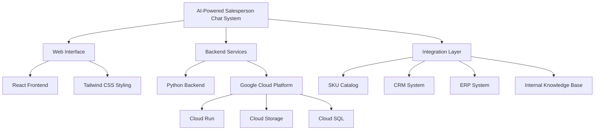
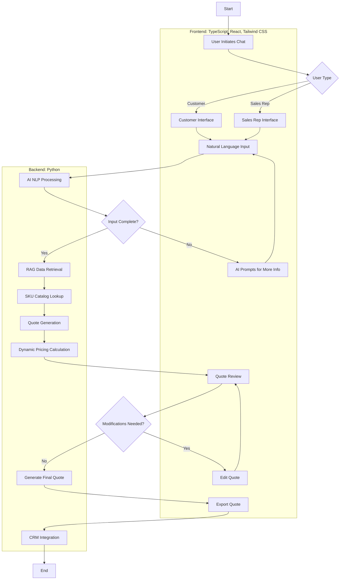
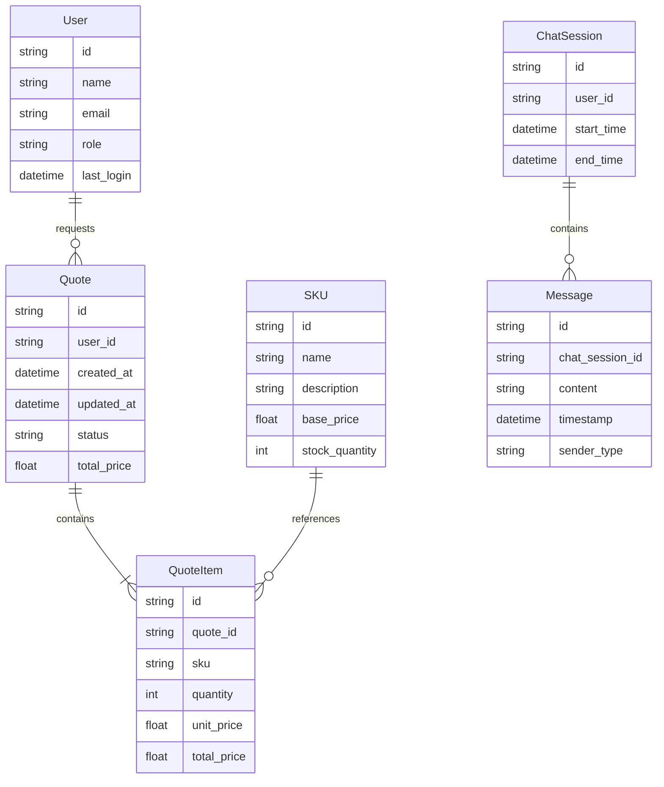
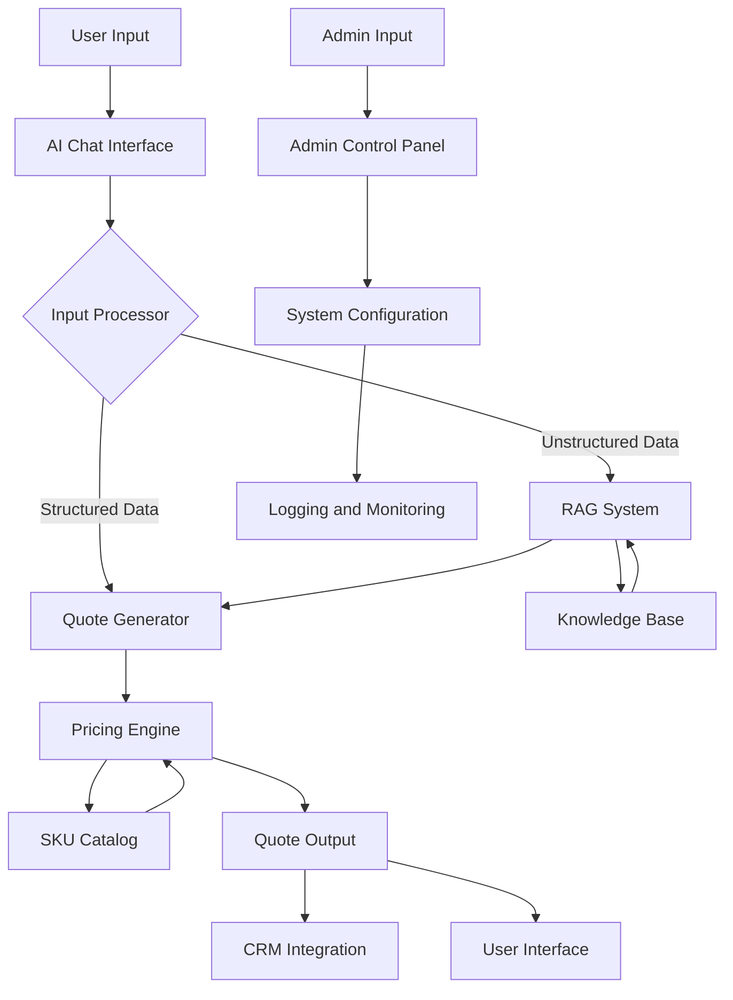
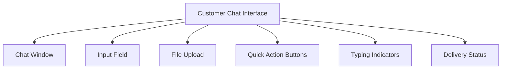

# 1. INTRODUCTION

## 1.1 PURPOSE

This Software Requirements Specification (SRS) document provides a comprehensive description of the AI-powered salesperson chat system. It outlines the functional and non-functional requirements, system architecture, and design constraints for the development team. The primary purposes of this document are:

1. To serve as a binding agreement between the development team and the client on the system's functionality and performance.
2. To provide a detailed reference for developers, testers, and system architects throughout the development lifecycle.
3. To establish clear acceptance criteria for the final product.

The intended audience for this SRS includes:

- Project stakeholders and decision-makers
- Software developers and engineers
- Quality assurance testers
- System administrators and IT personnel
- Technical writers and documentation specialists
- Future maintenance and support teams

## 1.2 SCOPE

The AI-powered salesperson chat system is a cutting-edge solution designed to revolutionize the part quoting and ordering process. This system aims to streamline customer interactions, automate quote generation, and enhance overall sales efficiency.

### Goals

1. Automate the ingestion and processing of customer part requirements
2. Leverage AI and Retrieval-Augmented Generation (RAG) to access and utilize internal company data effectively
3. Generate accurate, structured quotes based on customer inputs and company pricing data
4. Integrate seamlessly with existing company systems, including SKU catalogs, CRM, and ERP
5. Provide an intuitive interface for both sales representatives and customers

### Benefits

1. Reduced response time for customer inquiries and quote generation
2. Increased accuracy in part identification and pricing
3. Improved customer satisfaction through faster, more precise service
4. Enhanced sales team productivity by automating routine tasks
5. Better utilization of company data for informed decision-making
6. Scalable solution to handle growing customer demands

### Core Functionalities

1. **AI-Powered Chat Interface**
   - Natural language processing for requirement ingestion
   - Interactive prompts for gathering missing information
   - Multi-platform support (web, mobile) using React and Tailwind CSS

2. **Retrieval-Augmented Generation (RAG) System**
   - Integration with internal data sources (ERP, CRM, product catalogs)
   - Intelligent context-aware data retrieval
   - Customizable data source prioritization

3. **Quote Generation Engine**
   - Dynamic pricing based on SKU catalog and business rules
   - Support for bulk order discounts and custom pricing
   - Multi-part quote consolidation

4. **System Integration**
   - API-based integration with existing SKU catalog
   - Seamless connection to CRM and ERP systems
   - Real-time data synchronization

5. **User Management and Access Control**
   - Role-based access for sales representatives and customers
   - Secure authentication and authorization

6. **Reporting and Analytics**
   - Quote tracking and versioning
   - Performance metrics and business intelligence dashboards

7. **Administration and Configuration**
   - Web-based admin panel for system configuration
   - Customizable AI behavior and business rules

The system will be developed using a modern tech stack, including:

- Frontend: TypeScript, React, and Tailwind CSS for responsive and intuitive user interfaces
- Backend: Python for robust server-side logic and AI model integration
- Cloud Infrastructure: Google Cloud Platform for scalable, secure, and reliable hosting

By delivering these core functionalities, the AI-powered salesperson chat system will provide a transformative solution for streamlining the part quoting and ordering process, ultimately driving business growth and customer satisfaction.

# 2. PRODUCT DESCRIPTION

## 2.1 PRODUCT PERSPECTIVE

The AI-powered salesperson chat system is a comprehensive solution designed to revolutionize the part quoting and ordering process within the existing business ecosystem. It integrates seamlessly with the company's current infrastructure, including:

1. SKU Catalog: The system directly interfaces with the existing product catalog to access up-to-date part information and pricing.

2. Customer Relationship Management (CRM) System: Integration allows for automatic logging of quotes and customer interactions, maintaining a cohesive customer history.

3. Enterprise Resource Planning (ERP) System: The chat system pulls relevant data from the ERP to inform pricing decisions and inventory availability.

4. Internal Knowledge Base: The Retrieval-Augmented Generation (RAG) component leverages existing company documentation, past quotes, and product specifications to enhance response accuracy.

The system operates as a web-based application, accessible through modern web browsers on both desktop and mobile devices. It utilizes a cloud-based architecture hosted on Google Cloud Platform, ensuring scalability, reliability, and security.

## 2.2 PRODUCT FUNCTIONS

The AI-powered salesperson chat system provides the following key functions:

1. Natural Language Requirement Ingestion:
   - Process customer inquiries in natural language
   - Extract relevant part specifications and requirements

2. Intelligent Data Retrieval:
   - Utilize RAG technology to access and analyze internal company data
   - Retrieve relevant product information, pricing data, and historical quotes

3. Dynamic Quote Generation:
   - Generate accurate quotes based on customer requirements and company pricing rules
   - Apply bulk order discounts and custom pricing as appropriate

4. Multi-Part Quote Consolidation:
   - Handle complex queries for multiple parts
   - Consolidate information into a single, comprehensive quote

5. Interactive Clarification:
   - Prompt users for additional information when requirements are incomplete
   - Provide suggestions and alternatives based on available data

6. Quote Export and Sharing:
   - Generate formatted quotes in various formats (PDF, CSV)
   - Enable direct quote sharing via email

7. User Management and Access Control:
   - Support role-based access for sales representatives and customers
   - Integrate with existing CRM for user authentication and data synchronization

8. Analytics and Reporting:
   - Track quote generation metrics and conversion rates
   - Provide insights on quoting patterns and pricing trends

9. System Administration:
   - Allow configuration of AI behavior and business rules
   - Manage data source priorities and integration settings

## 2.3 USER CHARACTERISTICS

The system is designed to cater to three primary user groups:

1. Sales Representatives:
   - Expertise Level: Moderate to high familiarity with company products and quoting processes
   - Technical Proficiency: Basic to intermediate computer skills
   - Persona: "Sarah, the Seasoned Sales Rep" - 35 years old, 10+ years in sales, values efficiency and accuracy in quoting

2. Customers:
   - Expertise Level: Varies from novice to expert in product knowledge
   - Technical Proficiency: Basic computer and internet navigation skills
   - Persona: "Tom, the Tech Buyer" - 42 years old, procurement manager for a medium-sized manufacturing company, seeks quick and accurate quotes for bulk orders

3. System Administrators:
   - Expertise Level: High level of technical knowledge and understanding of business processes
   - Technical Proficiency: Advanced IT skills, familiar with cloud platforms and system integration
   - Persona: "Alex, the IT Admin" - 38 years old, experienced in managing enterprise software, responsible for system configuration and maintenance

## 2.4 CONSTRAINTS

1. Technical Constraints:
   - Must integrate with existing SKU catalog, CRM, and ERP systems without major modifications to these systems
   - System performance must maintain response times under 2 seconds for standard queries
   - Must support concurrent usage by at least 1000 users without degradation

2. Regulatory Constraints:
   - Must comply with data protection regulations (e.g., GDPR, CCPA) for handling customer information
   - Needs to adhere to industry-specific regulations for quoting and pricing transparency

3. Operational Constraints:
   - System downtime for maintenance must not exceed 2 hours per month
   - Must provide 24/7 availability with 99.9% uptime guarantee

4. Security Constraints:
   - All data transmissions must be encrypted using industry-standard protocols
   - User authentication must support multi-factor authentication
   - System must pass penetration testing before deployment

5. Usability Constraints:
   - User interface must be accessible and comply with WCAG 2.1 AA standards
   - System must support multiple languages for international use (initially English only, with capability to add languages)

6. Budget Constraints:
   - Development and first-year operational costs must not exceed the allocated budget of $708,400

## 2.5 ASSUMPTIONS AND DEPENDENCIES

Assumptions:

1. The existing SKU catalog, CRM, and ERP systems have stable APIs or integration points available
2. Company data (product information, pricing, past quotes) is accurate and up-to-date
3. Users have access to modern web browsers and stable internet connections
4. The company's IT infrastructure can support the additional load from the new system
5. Sales representatives and customers are willing to adopt the new AI-powered system

Dependencies:

1. Availability and accuracy of the SKU catalog for real-time product and pricing information
2. Reliability of the CRM system for customer data and interaction history
3. ERP system's ability to provide up-to-date inventory and costing information
4. Continued access to and performance of Google Cloud Platform services
5. Timely provision of necessary data and access permissions from the client's IT department
6. Availability of subject matter experts for AI training and system configuration
7. Timely completion of user acceptance testing and feedback incorporation
8. Successful integration with existing security and authentication systems
9. Availability of training resources for sales staff and system administrators
10. Ongoing support and updates for third-party libraries and frameworks used in development (React, Tailwind CSS, Python packages)

## PROCESS FLOWCHART

The following flowchart illustrates the high-level process flow for the AI-powered salesperson chat system:

This flowchart outlines the main processes involved in the AI-powered salesperson chat system, from user input to quote generation and CRM integration. Key components and their interactions are as follows:

1. User Initiation:
   - The process begins when either a customer or a sales representative initiates a chat session.
   - The system presents an appropriate interface based on the user type.

2. Natural Language Processing:
   - Users input their requirements in natural language.
   - The AI processes this input using NLP techniques.
   - If the input is incomplete, the AI prompts for additional information.

3. Data Retrieval and Processing:
   - Once the input is complete, the RAG (Retrieval-Augmented Generation) system retrieves relevant data from internal sources.
   - The system then performs a lookup in the SKU catalog for matching products.

4. Quote Generation:
   - The quote generation engine creates a preliminary quote based on the retrieved data.
   - Dynamic pricing calculations are applied, considering factors like quantity discounts.

5. Review and Modification:
   - Users review the generated quote.
   - If modifications are needed, users can edit the quote, which then goes through the pricing calculation again.

6. Finalization and Integration:
   - Once approved, the final quote is generated.
   - Users can export the quote in various formats.
   - The system integrates the quote information with the CRM for record-keeping and follow-up.

This process flow ensures a streamlined, AI-driven approach to quote generation, leveraging the power of natural language processing, intelligent data retrieval, and integration with existing systems. The frontend components, built with TypeScript, React, and Tailwind CSS, provide a responsive and intuitive user interface, while the Python backend handles the complex processing and integration tasks.

Here's a breakdown of the AI-powered salesperson chat system into features, with the requested sub-sections for each:

1. AI-Powered Chat Interface

ID: F001
DESCRIPTION: A web-based chat interface that allows users (customers and sales representatives) to input part requirements in natural language and receive interactive responses.
PRIORITY: High

| Requirement ID | Requirement Description |
|----------------|--------------------------|
| F001-1 | Implement a responsive chat UI using React and Tailwind CSS |
| F001-2 | Integrate natural language processing capabilities using Python backend |
| F001-3 | Provide real-time typing indicators and message delivery status |
| F001-4 | Support file uploads (e.g., drawings, specifications) within the chat |
| F001-5 | Implement user authentication and session management |

2. Retrieval-Augmented Generation (RAG) System

ID: F002
DESCRIPTION: A system that leverages RAG technology to retrieve and process relevant information from internal company data sources to enhance chat responses and quote generation.
PRIORITY: High

| Requirement ID | Requirement Description |
|----------------|--------------------------|
| F002-1 | Develop a Python-based RAG engine integrated with Google Cloud AI Platform |
| F002-2 | Implement connectors for various data sources (ERP, CRM, product catalogs) |
| F002-3 | Create an indexing system for efficient data retrieval |
| F002-4 | Develop context-aware algorithms for relevant information extraction |
| F002-5 | Implement a caching mechanism to optimize performance |

3. Quote Generation Engine

ID: F003
DESCRIPTION: An automated system that generates accurate quotes based on user requirements, SKU catalog data, and pricing rules.
PRIORITY: High

| Requirement ID | Requirement Description |
|----------------|--------------------------|
| F003-1 | Develop a Python-based quote calculation engine |
| F003-2 | Integrate with the company's SKU catalog and pricing database |
| F003-3 | Implement dynamic pricing algorithms including bulk discounts |
| F003-4 | Generate structured quote outputs in multiple formats (JSON, PDF) |
| F003-5 | Support multi-part quotes and quote versioning |

4. Admin Control Panel

ID: F004
DESCRIPTION: A web-based interface for system administrators to configure AI behavior, manage data sources, and monitor system performance.
PRIORITY: Medium

| Requirement ID | Requirement Description |
|----------------|--------------------------|
| F004-1 | Create a React-based admin dashboard with Tailwind CSS styling |
| F004-2 | Implement role-based access control for admin functions |
| F004-3 | Provide interfaces for configuring AI behavior and business rules |
| F004-4 | Develop tools for managing and prioritizing data sources |
| F004-5 | Implement system monitoring and logging features |

5. Integration Layer

ID: F005
DESCRIPTION: A set of APIs and services that enable seamless integration with existing company systems (SKU catalog, CRM, ERP).
PRIORITY: High

| Requirement ID | Requirement Description |
|----------------|--------------------------|
| F005-1 | Develop RESTful APIs using Python (Flask or FastAPI) |
| F005-2 | Implement real-time data synchronization with SKU catalog |
| F005-3 | Create bidirectional integration with CRM for customer data and quote logging |
| F005-4 | Establish secure connections with ERP for inventory and pricing data |
| F005-5 | Implement error handling and retry mechanisms for failed integrations |

6. Reporting and Analytics

ID: F006
DESCRIPTION: A system for generating insights on quoting patterns, conversion rates, and system performance.
PRIORITY: Medium

| Requirement ID | Requirement Description |
|----------------|--------------------------|
| F006-1 | Develop a data warehouse using Google BigQuery |
| F006-2 | Create ETL processes for aggregating data from various system components |
| F006-3 | Implement a React-based dashboard for visualizing key metrics |
| F006-4 | Develop custom report generation capabilities with export options |
| F006-5 | Implement real-time system performance monitoring and alerting |

7. User Management and Authentication

ID: F007
DESCRIPTION: A system for managing user accounts, roles, and authentication for both internal users and customers.
PRIORITY: High

| Requirement ID | Requirement Description |
|----------------|--------------------------|
| F007-1 | Implement user authentication using Google Cloud Identity Platform |
| F007-2 | Develop role-based access control for different user types |
| F007-3 | Create user profile management interfaces using React |
| F007-4 | Implement secure password policies and multi-factor authentication |
| F007-5 | Develop an audit trail for user actions and system access |

8. Mobile Responsiveness

ID: F008
DESCRIPTION: Ensure the chat interface and key system features are accessible and fully functional on mobile devices.
PRIORITY: Medium

| Requirement ID | Requirement Description |
|----------------|--------------------------|
| F008-1 | Develop responsive layouts using Tailwind CSS for all user interfaces |
| F008-2 | Optimize chat interface for touch interactions on mobile devices |
| F008-3 | Implement progressive loading for improved performance on slower connections |
| F008-4 | Ensure compatibility with major mobile browsers (Chrome, Safari, Firefox) |
| F008-5 | Develop a simplified mobile view for quick quote checks and approvals |

These features cover the core functionalities of the AI-powered salesperson chat system, aligning with the previously outlined requirements and technology choices. The use of TypeScript, React, and Tailwind CSS for UIs, Python for backends, and Google Cloud solutions ensures consistency with the overall system architecture and design decisions.

# 3. NON-FUNCTIONAL REQUIREMENTS

## 3.1 PERFORMANCE

| Requirement ID | Description |
|----------------|-------------|
| NFR-P-01 | The system shall respond to user inputs within 2 seconds under normal load conditions. |
| NFR-P-02 | The AI chat interface shall process and respond to user queries within 5 seconds for 95% of requests. |
| NFR-P-03 | The quote generation engine shall produce quotes in less than 10 seconds for standard requests. |
| NFR-P-04 | The system shall support at least 1000 concurrent users without degradation in performance. |
| NFR-P-05 | API calls to integrated systems (SKU catalog, CRM, ERP) shall have a maximum latency of 100ms. |
| NFR-P-06 | The system shall maintain a minimum throughput of 100 quotes generated per minute during peak hours. |
| NFR-P-07 | Database queries shall execute within 500ms for 99% of requests. |
| NFR-P-08 | The React-based frontend shall achieve a Lighthouse performance score of at least 90. |
| NFR-P-09 | The system shall utilize no more than 80% of allocated CPU and memory resources under peak load. |
| NFR-P-10 | Full system backups shall complete within 1 hour without impacting system performance. |

## 3.2 SAFETY

| Requirement ID | Description |
|----------------|-------------|
| NFR-S-01 | The system shall implement automatic data backups every 6 hours to prevent data loss. |
| NFR-S-02 | In case of system failure, the last stable state shall be restored within 15 minutes. |
| NFR-S-03 | The system shall provide a mechanism to roll back to the previous version in case of critical failures during updates. |
| NFR-S-04 | All user inputs shall be validated and sanitized to prevent injection attacks and data corruption. |
| NFR-S-05 | The system shall implement rate limiting to prevent abuse and ensure fair usage. |
| NFR-S-06 | Critical system errors shall trigger immediate notifications to the system administrators. |
| NFR-S-07 | The system shall maintain an audit log of all critical operations for forensic analysis. |
| NFR-S-08 | In the event of a third-party API failure, the system shall gracefully degrade and continue core operations. |
| NFR-S-09 | The system shall implement a dead man's switch to automatically shut down if critical monitoring systems fail. |
| NFR-S-10 | All generated quotes shall be versioned to allow for auditing and rollback if necessary. |

## 3.3 SECURITY

| Requirement ID | Description |
|----------------|-------------|
| NFR-SEC-01 | The system shall use Google Cloud Identity Platform for user authentication and authorization. |
| NFR-SEC-02 | All data transmissions shall be encrypted using TLS 1.3 or higher. |
| NFR-SEC-03 | User passwords shall be hashed using bcrypt with a minimum work factor of 10. |
| NFR-SEC-04 | The system shall implement role-based access control (RBAC) with at least three distinct roles: admin, sales representative, and customer. |
| NFR-SEC-05 | Multi-factor authentication (MFA) shall be mandatory for all admin and sales representative accounts. |
| NFR-SEC-06 | The system shall enforce a password policy requiring a minimum of 12 characters, including uppercase, lowercase, numbers, and special characters. |
| NFR-SEC-07 | All API endpoints shall be protected using OAuth 2.0 with JWT tokens. |
| NFR-SEC-08 | The system shall implement CORS policies to prevent unauthorized cross-origin requests. |
| NFR-SEC-09 | Sensitive data at rest shall be encrypted using AES-256 encryption. |
| NFR-SEC-10 | The system shall undergo penetration testing by a third-party security firm at least once a year. |

## 3.4 QUALITY

### 3.4.1 Availability

| Requirement ID | Description |
|----------------|-------------|
| NFR-Q-A-01 | The system shall maintain 99.9% uptime during business hours (8 AM to 8 PM local time). |
| NFR-Q-A-02 | Planned maintenance windows shall not exceed 4 hours per month and must be scheduled outside of peak usage hours. |
| NFR-Q-A-03 | The system shall implement automatic failover to a secondary region with a Recovery Time Objective (RTO) of 5 minutes. |

### 3.4.2 Maintainability

| Requirement ID | Description |
|----------------|-------------|
| NFR-Q-M-01 | The system shall follow a microservices architecture to allow for independent scaling and updates of components. |
| NFR-Q-M-02 | All code shall adhere to established coding standards and maintain a minimum of 80% test coverage. |
| NFR-Q-M-03 | The system shall use containerization (Docker) and orchestration (Kubernetes) for easy deployment and scaling. |

### 3.4.3 Usability

| Requirement ID | Description |
|----------------|-------------|
| NFR-Q-U-01 | The user interface shall be responsive and compatible with devices ranging from 320px to 2560px in width. |
| NFR-Q-U-02 | The system shall comply with WCAG 2.1 Level AA accessibility standards. |
| NFR-Q-U-03 | The user interface shall be localized to support at least English and Spanish languages. |

### 3.4.4 Scalability

| Requirement ID | Description |
|----------------|-------------|
| NFR-Q-S-01 | The system shall be capable of scaling horizontally to handle a 200% increase in user load within 5 minutes. |
| NFR-Q-S-02 | Database read operations shall be distributed across read replicas to support increased query loads. |
| NFR-Q-S-03 | The system shall implement caching mechanisms (e.g., Redis) to reduce database load for frequently accessed data. |

### 3.4.5 Reliability

| Requirement ID | Description |
|----------------|-------------|
| NFR-Q-R-01 | The system shall have a Mean Time Between Failures (MTBF) of at least 720 hours. |
| NFR-Q-R-02 | The system shall implement circuit breakers to prevent cascading failures in microservices. |
| NFR-Q-R-03 | All critical system components shall have a minimum of N+1 redundancy. |

## 3.5 COMPLIANCE

| Requirement ID | Description |
|----------------|-------------|
| NFR-C-01 | The system shall comply with GDPR requirements for data protection and privacy. |
| NFR-C-02 | The system shall adhere to PCI DSS standards for handling payment card information. |
| NFR-C-03 | All data storage and processing shall comply with relevant data residency laws. |
| NFR-C-04 | The system shall maintain audit logs in compliance with SOX requirements. |
| NFR-C-05 | The AI components shall adhere to ethical AI principles and avoid bias in decision-making. |
| NFR-C-06 | The system shall comply with CCPA requirements for California residents' data privacy. |
| NFR-C-07 | All third-party libraries and components used in the system shall be properly licensed and documented. |
| NFR-C-08 | The system shall implement data retention policies in accordance with applicable regulations. |
| NFR-C-09 | The system shall provide mechanisms for users to exercise their rights under applicable privacy laws (e.g., right to be forgotten, data portability). |
| NFR-C-10 | The system shall undergo annual compliance audits to ensure adherence to all relevant standards and regulations. |

# 4. DATA REQUIREMENTS

## 4.1 DATA MODELS

The AI-powered salesperson chat system will utilize the following data models to represent and manage information:

These data models will be implemented using appropriate database schemas and object-relational mapping (ORM) tools in the Python backend.

## 4.2 DATA STORAGE

The AI-powered salesperson chat system will utilize Google Cloud Platform (GCP) for data storage, ensuring scalability, reliability, and security.

### Primary Data Storage

- **Google Cloud SQL**: A fully managed relational database service will be used for storing structured data such as user information, quotes, SKUs, and chat sessions.
  - Instance Type: High-availability configuration with read replicas for improved performance
  - Database Engine: PostgreSQL 13 or later

### Unstructured Data Storage

- **Google Cloud Storage**: Object storage for large files such as product images, technical drawings, and system backups.
  - Storage Class: Standard storage for frequently accessed data
  - Regional bucket configuration for lower latency

### Caching Layer

- **Google Cloud Memorystore**: A fully managed in-memory data store service for Redis, used to cache frequently accessed data and improve system performance.
  - Cache Size: Initially provisioned for 5GB, scalable based on demand
  - Persistence: Enabled for data recovery in case of failures

### Data Retention

- Transactional Data (Quotes, User Activities): Retained for 7 years to comply with business and regulatory requirements
- Chat Logs: Retained for 2 years for analysis and auditing purposes
- System Logs: Retained for 1 year for troubleshooting and security audits

### Redundancy and Backup

1. **Database Redundancy**:
   - Google Cloud SQL instances configured with synchronous replication across multiple zones within the same region
   - Read replicas deployed for load distribution and as hot standbys

2. **Backup Strategy**:
   - Automated daily backups of Google Cloud SQL databases
   - Point-in-time recovery enabled with transaction log retention of 7 days
   - Weekly full backups of all data stored in Google Cloud Storage

3. **Disaster Recovery**:
   - Cross-region replication of critical data to a secondary GCP region
   - Regular disaster recovery drills to ensure RTO (Recovery Time Objective) of 4 hours and RPO (Recovery Point Objective) of 15 minutes

### Data Recovery

1. **Database Recovery**:
   - Utilize Google Cloud SQL's point-in-time recovery for granular data restoration
   - Automated failover to read replicas in case of primary instance failure

2. **Object Storage Recovery**:
   - Version control enabled on Google Cloud Storage buckets for easy file recovery
   - Cross-region replication for critical data to enable quick recovery in case of regional outages

3. **System-wide Recovery**:
   - Implement infrastructure-as-code using Terraform for quick and consistent environment recreation
   - Maintain up-to-date runbooks for manual recovery procedures

## 4.3 DATA PROCESSING

The AI-powered salesperson chat system will process data through various components, ensuring security and efficiency throughout the data lifecycle.

### Data Flow

### Data Security

1. **Encryption**:
   - Data at rest: All data stored in Google Cloud SQL and Google Cloud Storage will be encrypted using Google-managed encryption keys (GMEK)
   - Data in transit: All network communications will use TLS 1.3 or higher

2. **Access Control**:
   - Implement Identity and Access Management (IAM) policies in Google Cloud Platform
   - Use principle of least privilege for service accounts and user roles
   - Enable multi-factor authentication (MFA) for all user accounts

3. **Data Anonymization**:
   - Implement data masking for sensitive information in non-production environments
   - Use tokenization for personally identifiable information (PII) in analytics datasets

4. **Audit Logging**:
   - Enable comprehensive audit logging in Google Cloud Platform
   - Implement application-level logging for all data access and modifications
   - Use Google Cloud's Operations suite (formerly Stackdriver) for log analysis and alerting

5. **Secure Data Processing**:
   - Implement input validation and sanitization for all user inputs
   - Use parameterized queries to prevent SQL injection attacks
   - Implement rate limiting on API endpoints to prevent abuse

6. **Secure Development Practices**:
   - Conduct regular security code reviews
   - Implement static code analysis in the CI/CD pipeline
   - Perform periodic penetration testing and vulnerability assessments

7. **Data Loss Prevention**:
   - Utilize Google Cloud DLP (Data Loss Prevention) API to scan and redact sensitive data
   - Implement controls to prevent unauthorized data exfiltration

8. **Compliance**:
   - Ensure GDPR compliance for handling European user data
   - Implement necessary controls for PCI DSS compliance for handling payment information

By implementing these data processing and security measures, the AI-powered salesperson chat system will ensure the confidentiality, integrity, and availability of data throughout its lifecycle. The system will leverage Google Cloud Platform's robust security features while implementing additional application-level security measures to create a comprehensive data protection strategy.

# 5. EXTERNAL INTERFACES

## 5.1 USER INTERFACES

The AI-powered salesperson chat system will provide a web-based user interface accessible through modern web browsers on both desktop and mobile devices. The interface will be developed using React for component structure and Tailwind CSS for styling, ensuring a responsive and intuitive design.

### 5.1.1 Customer Chat Interface

The customer-facing chat interface will include the following elements:

- Chat window with message history
- Input field for typing messages
- File upload button for attaching relevant documents (e.g., drawings, specifications)
- Quick action buttons for common requests (e.g., "Request Quote", "Check Order Status")
- Real-time typing indicators
- Message delivery status indicators

### 5.1.2 Sales Representative Dashboard

The sales representative dashboard will include:

- Chat interface similar to the customer interface
- Quote management panel
- Customer information sidebar
- SKU catalog search functionality
- Order history and status tracking

### 5.1.3 Admin Control Panel

The admin control panel will feature:

- System configuration options
- User management interface
- Data source prioritization settings
- Performance monitoring dashboard
- Audit log viewer

Placeholder for UI mockups:
[Detailed mockups for each interface will be inserted here after design phase]

## 5.2 HARDWARE INTERFACES

The AI-powered salesperson chat system is primarily a software solution and does not require specific hardware interfaces. However, it will be designed to operate efficiently on the following hardware:

- Server Hardware:
  - Google Cloud Compute Engine instances
  - Minimum 8 vCPUs, 32 GB RAM for application servers
  - Minimum 16 vCPUs, 64 GB RAM for database servers

- Client Hardware:
  - Any device capable of running a modern web browser
  - Minimum screen resolution of 320px width for mobile devices
  - Recommended screen resolution of 1024x768 or higher for desktop devices

## 5.3 SOFTWARE INTERFACES

The system will interface with several external software components:

### 5.3.1 SKU Catalog Integration

- Interface Type: RESTful API
- Data Format: JSON
- Protocol: HTTPS
- Functionality: Retrieve product information, pricing, and availability

### 5.3.2 CRM Integration

- Interface Type: RESTful API
- Data Format: JSON
- Protocol: HTTPS
- Functionality: Retrieve customer information, update customer records, log interactions

### 5.3.3 ERP Integration

- Interface Type: RESTful API
- Data Format: JSON
- Protocol: HTTPS
- Functionality: Retrieve inventory data, update order information

### 5.3.4 Google Cloud Services

- Cloud SQL:
  - Interface Type: SQL API
  - Functionality: Store and retrieve application data

- Cloud Storage:
  - Interface Type: Google Cloud Storage API
  - Functionality: Store and retrieve files (e.g., product images, customer uploads)

- Cloud AI Platform:
  - Interface Type: AI Platform API
  - Functionality: Host and run machine learning models for NLP and RAG

## 5.4 COMMUNICATION INTERFACES

The AI-powered salesperson chat system will utilize the following communication interfaces:

### 5.4.1 Web Socket Communication

- Protocol: WebSocket (WSS)
- Purpose: Real-time bidirectional communication for chat functionality
- Library: Socket.IO or similar WebSocket library for React

### 5.4.2 HTTP/HTTPS Communication

- Protocol: HTTP/2 over TLS (HTTPS)
- Purpose: RESTful API calls for data retrieval and updates
- Implementation: Axios or Fetch API for frontend, FastAPI or Flask for backend API

### 5.4.3 Database Communication

- Protocol: TCP/IP
- Purpose: Communication between application servers and database servers
- Implementation: SQLAlchemy ORM for Python backend

### 5.4.4 Email Communication

- Protocol: SMTP
- Purpose: Sending quote notifications and system alerts
- Implementation: Google Cloud Functions with Sendgrid or similar email service

### 5.4.5 File Transfer

- Protocol: HTTPS
- Purpose: Uploading and downloading files (e.g., product specifications, customer documents)
- Implementation: Google Cloud Storage API

### 5.4.6 Authentication

- Protocol: OAuth 2.0
- Purpose: User authentication and authorization
- Implementation: Google Cloud Identity Platform

All communication interfaces will adhere to industry-standard security practices, including:

- TLS 1.3 encryption for all data in transit
- JWT (JSON Web Tokens) for API authentication
- Rate limiting to prevent abuse
- Input validation and sanitization to prevent injection attacks

These communication interfaces ensure secure, efficient, and real-time data exchange between all components of the AI-powered salesperson chat system, as well as with external systems and users.

# 6. APPENDICES

## 6.1 GLOSSARY

| Term | Definition |
|------|------------|
| Retrieval-Augmented Generation (RAG) | A technique that combines information retrieval with language generation to produce more accurate and context-aware responses. |
| Natural Language Processing (NLP) | A branch of artificial intelligence that deals with the interaction between computers and humans using natural language. |
| SKU | Stock Keeping Unit, a unique identifier for each distinct product and service that can be purchased. |
| Dynamic Pricing | The practice of varying the price for a product or service based on current market demands. |
| Bulk Order Discount | A reduction in price offered to customers who purchase large quantities of a product. |
| Quote Versioning | The practice of tracking and managing different versions of a quote as it is revised over time. |
| Audit Trail | A chronological record of system activities that allows for the reconstruction and examination of the sequence of events. |

## 6.2 ACRONYMS

| Acronym | Expanded Form |
|---------|---------------|
| AI | Artificial Intelligence |
| API | Application Programming Interface |
| CRM | Customer Relationship Management |
| CSV | Comma-Separated Values |
| ERP | Enterprise Resource Planning |
| GDPR | General Data Protection Regulation |
| JWT | JSON Web Token |
| MVP | Minimum Viable Product |
| NLP | Natural Language Processing |
| PDF | Portable Document Format |
| RAG | Retrieval-Augmented Generation |
| REST | Representational State Transfer |
| ROI | Return on Investment |
| SKU | Stock Keeping Unit |
| SRS | Software Requirements Specification |
| TLS | Transport Layer Security |
| UI | User Interface |
| UX | User Experience |
| WCAG | Web Content Accessibility Guidelines |

## 6.3 ADDITIONAL REFERENCES

1. React Documentation
   - https://reactjs.org/docs/getting-started.html
   - Reference for building the user interface components

2. Tailwind CSS Documentation
   - https://tailwindcss.com/docs
   - Guide for utilizing the utility-first CSS framework

3. TypeScript Handbook
   - https://www.typescriptlang.org/docs/handbook/intro.html
   - Comprehensive guide for TypeScript usage in the frontend

4. Python Official Documentation
   - https://docs.python.org/3/
   - Reference for Python backend development

5. Google Cloud Documentation
   - https://cloud.google.com/docs
   - Guides for utilizing Google Cloud services in the project

6. FastAPI Documentation
   - https://fastapi.tiangolo.com/
   - Reference for building high-performance APIs with Python

7. SQLAlchemy Documentation
   - https://docs.sqlalchemy.org/en/14/
   - Guide for working with databases in Python

8. Socket.IO Documentation
   - https://socket.io/docs/v4/
   - Reference for implementing real-time, bidirectional communication

9. OAuth 2.0 Specification
   - https://oauth.net/2/
   - Standard for secure API authorization

10. WCAG 2.1 Guidelines
    - https://www.w3.org/TR/WCAG21/
    - Accessibility standards for web content

11. "Designing Data-Intensive Applications" by Martin Kleppmann
    - Book reference for building scalable and maintainable software systems

12. "Clean Code: A Handbook of Agile Software Craftsmanship" by Robert C. Martin
    - Book reference for writing high-quality, maintainable code

These additional references provide valuable resources for the development team to consult throughout the project lifecycle, ensuring adherence to best practices and leveraging the full capabilities of the chosen technologies.