# 1. INTRODUCTION

## 1.1 SYSTEM OVERVIEW

The AI-powered salesperson chat system is a comprehensive solution designed to revolutionize the part quoting and ordering process for businesses. This system leverages cutting-edge artificial intelligence, natural language processing, and data retrieval technologies to provide an efficient, accurate, and user-friendly experience for both customers and sales representatives.

### Key Components

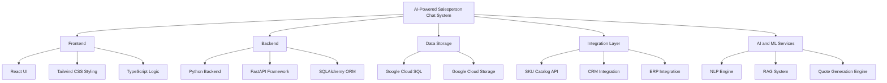

### System Architecture

The AI-powered salesperson chat system is built on a modern, scalable architecture leveraging the following technologies:

1. **Frontend**:
   - React for building interactive user interfaces
   - Tailwind CSS for responsive and customizable styling
   - TypeScript for type-safe JavaScript development

2. **Backend**:
   - Python for robust server-side logic
   - FastAPI for high-performance API development
   - SQLAlchemy for object-relational mapping

3. **Data Storage**:
   - Google Cloud SQL for relational database management
   - Google Cloud Storage for object storage (documents, images)

4. **AI and Machine Learning**:
   - Google Cloud AI Platform for hosting and running ML models
   - Custom NLP engine for processing natural language inputs
   - Retrieval-Augmented Generation (RAG) system for intelligent data retrieval

5. **Integration Layer**:
   - RESTful APIs for communication with external systems (SKU catalog, CRM, ERP)
   - WebSocket for real-time bidirectional communication

6. **Deployment and Scaling**:
   - Google Cloud Run for containerized application deployment
   - Google Cloud Load Balancing for traffic distribution
   - Google Cloud Monitoring for system health and performance tracking

### Key Features

| Feature | Description |
|---------|-------------|
| Natural Language Chat Interface | Allows users to input requirements and queries in natural language |
| Intelligent Data Retrieval | Uses RAG technology to fetch relevant information from various data sources |
| Dynamic Quote Generation | Automatically generates accurate quotes based on user requirements and pricing rules |
| Multi-Part Quote Handling | Supports complex queries for multiple parts and consolidates them into a single quote |
| Integration with Existing Systems | Seamlessly connects with SKU catalog, CRM, and ERP systems |
| User Role Management | Supports different interfaces and permissions for customers, sales representatives, and administrators |
| Analytics and Reporting | Provides insights on quoting patterns, conversion rates, and system performance |
| Mobile Responsiveness | Ensures full functionality across various devices and screen sizes |

This AI-powered salesperson chat system represents a significant advancement in automating and optimizing the sales process. By combining state-of-the-art AI technologies with robust integration capabilities, the system aims to improve efficiency, accuracy, and customer satisfaction in the part quoting and ordering workflow.

# 7. SYSTEM ARCHITECTURE

## 7.1 PROGRAMMING LANGUAGES

The AI-powered salesperson chat system will utilize the following programming languages:

| Language | Purpose | Justification |
|----------|---------|---------------|
| TypeScript | Frontend development | Provides static typing for JavaScript, enhancing code quality and developer productivity. Ideal for building complex React applications. |
| Python | Backend development, AI/ML components | Versatile language with extensive libraries for web development (FastAPI), data processing, and machine learning. Excellent for implementing RAG and NLP components. |
| SQL | Database queries | Standard language for interacting with relational databases, used in conjunction with SQLAlchemy ORM. |
| HTML5/CSS3 | Frontend markup and styling | Industry standards for web content structure and presentation. CSS3 used via Tailwind CSS for efficient styling. |

## 7.2 HIGH-LEVEL ARCHITECTURE DIAGRAM

The following diagram provides an overview of the system's components and their interactions:

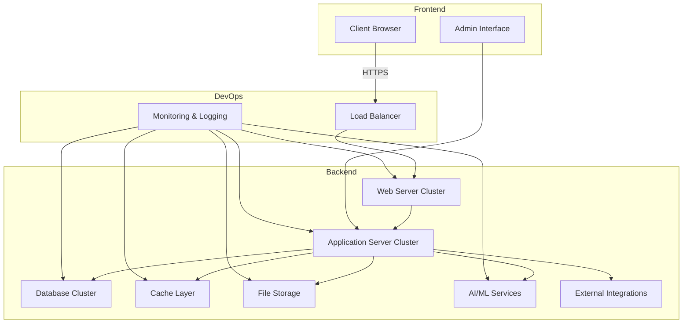

## 7.3 COMPONENT DIAGRAMS

### 7.3.1 Frontend Components

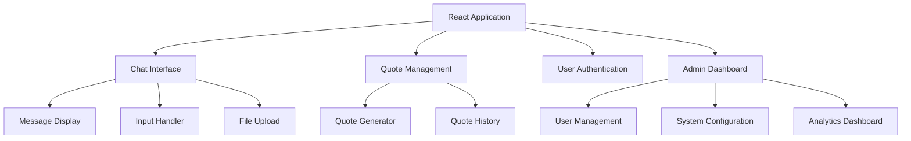

### 7.3.2 Backend Components

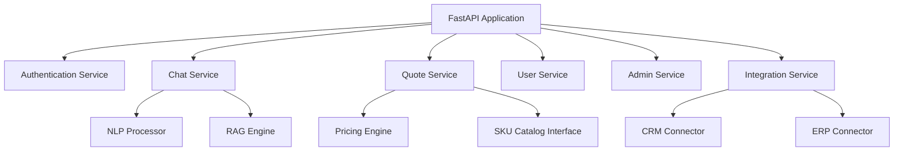

## 7.4 SEQUENCE DIAGRAMS

### 7.4.1 User Authentication Flow

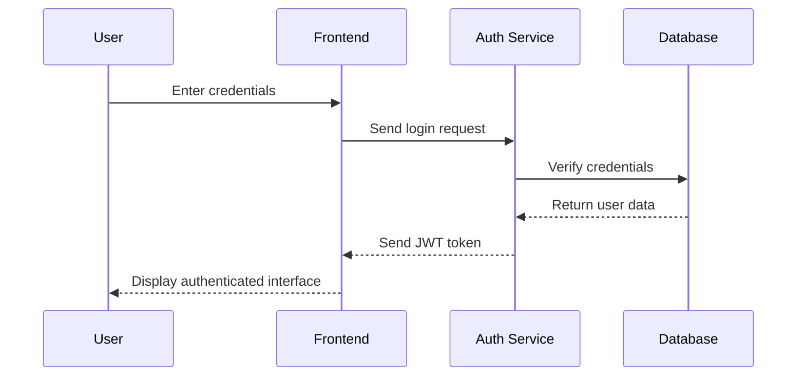

### 7.4.2 Quote Generation Flow

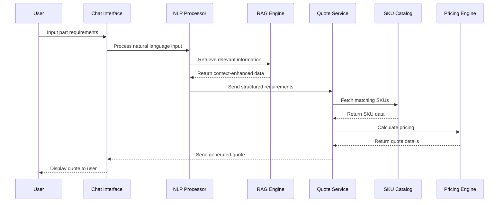

## 7.5 DATA-FLOW DIAGRAM

The following diagram illustrates how information moves through the AI-powered salesperson chat system:

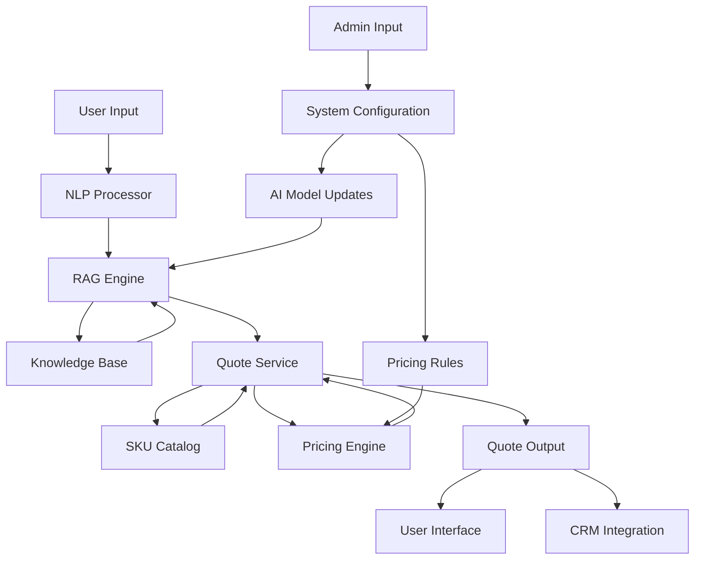

In this data flow:

1. User input is processed by the NLP component to extract intent and entities.
2. The RAG engine retrieves relevant information from the knowledge base to enhance the understanding of the request.
3. The Quote Service uses the processed information to fetch relevant SKUs from the catalog.
4. The Pricing Engine applies business rules and dynamic pricing to generate a quote.
5. The generated quote is presented to the user and optionally integrated with the CRM system.
6. Admins can configure the system, update AI models, and modify pricing rules, which feed back into the quote generation process.

This architecture ensures a seamless flow of information from user input to quote generation, leveraging AI components and integrating with external systems to provide accurate and context-aware responses.

# 7. SYSTEM DESIGN

## 7.1 PROGRAMMING LANGUAGES

The AI-powered salesperson chat system will utilize the following programming languages:

| Language | Purpose | Justification |
|----------|---------|---------------|
| TypeScript | Frontend development | Provides static typing for JavaScript, enhancing code quality and developer productivity. Ideal for building complex React applications. |
| Python | Backend development, AI/ML components | Versatile language with extensive libraries for web development (FastAPI), data processing, and machine learning. Excellent for implementing RAG and NLP components. |
| SQL | Database queries | Standard language for interacting with relational databases, used in conjunction with SQLAlchemy ORM. |
| HTML5/CSS3 | Frontend markup and styling | Industry standards for web content structure and presentation. CSS3 used via Tailwind CSS for efficient styling. |

## 7.2 DATABASE DESIGN

The system will use Google Cloud SQL with PostgreSQL as the relational database management system. The database schema is designed to support the core functionalities of the AI-powered salesperson chat system:

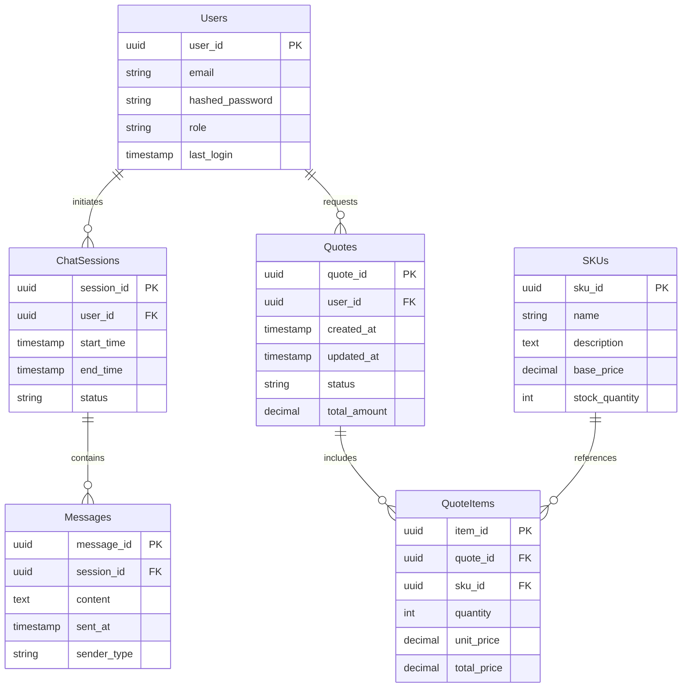

## 7.3 API DESIGN

The system will use a RESTful API design implemented with FastAPI in Python. The main API endpoints include:

1. Authentication
   - POST /auth/login
   - POST /auth/logout
   - POST /auth/refresh-token

2. Chat Sessions
   - POST /chat/sessions
   - GET /chat/sessions/{session_id}
   - POST /chat/sessions/{session_id}/messages

3. Quotes
   - POST /quotes
   - GET /quotes/{quote_id}
   - PUT /quotes/{quote_id}
   - DELETE /quotes/{quote_id}

4. SKU Catalog
   - GET /skus
   - GET /skus/{sku_id}

5. User Management
   - GET /users/{user_id}
   - PUT /users/{user_id}
   - POST /users

Example API response for a quote:

```json
{
  "quote_id": "550e8400-e29b-41d4-a716-446655440000",
  "user_id": "7c9e6679-7425-40de-944b-e07fc1f90ae7",
  "created_at": "2023-04-01T12:00:00Z",
  "updated_at": "2023-04-01T12:30:00Z",
  "status": "pending",
  "total_amount": 1250.00,
  "items": [
    {
      "item_id": "a3e4d78f-3b82-4d1c-a567-89b0c1f12345",
      "sku_id": "b2c3d4e5-f6g7-h8i9-j0k1-l2m3n4o5p6q7",
      "quantity": 5,
      "unit_price": 250.00,
      "total_price": 1250.00
    }
  ]
}
```

## 7.4 USER INTERFACE DESIGN

The user interface will be built using React with TypeScript and styled using Tailwind CSS. The main components of the UI include:

1. Chat Interface
2. Quote Management Dashboard
3. Admin Control Panel

### 7.4.1 Chat Interface

The chat interface will be the primary point of interaction for customers and sales representatives. It will include the following components:

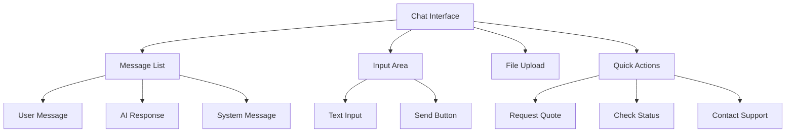

Key features:
- Real-time message updates using WebSocket
- Markdown support for rich text formatting in AI responses
- Syntax highlighting for code snippets
- Responsive design for mobile and desktop

### 7.4.2 Quote Management Dashboard

The quote management dashboard will allow sales representatives to manage and track quotes:

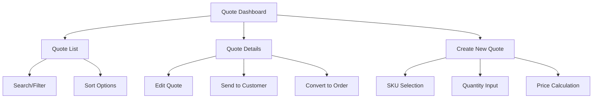

Key features:
- Drag-and-drop interface for adding SKUs to quotes
- Real-time price calculations
- PDF export for quotes
- Integration with CRM for customer information

### 7.4.3 Admin Control Panel

The admin control panel will provide system administrators with tools to manage the AI-powered salesperson chat system:

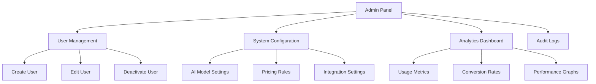

Key features:
- Role-based access control
- Real-time system health monitoring
- Customizable dashboards for different admin roles
- Ability to fine-tune AI model parameters

The user interface will be designed with accessibility in mind, adhering to WCAG 2.1 AA standards. It will also support theming to allow for easy customization of the look and feel to match the client's branding.

By leveraging React, TypeScript, and Tailwind CSS, the user interface will be modular, type-safe, and easily maintainable. The use of Google Cloud's ecosystem will ensure scalability and reliability of the backend services, while Python and FastAPI provide a robust and efficient API layer for the system.

# 8. TECHNOLOGY STACK

## 8.1 PROGRAMMING LANGUAGES

| Language | Purpose | Justification |
|----------|---------|---------------|
| TypeScript | Frontend development | Provides static typing for JavaScript, enhancing code quality and developer productivity. Ideal for building complex React applications. |
| Python | Backend development, AI/ML components | Versatile language with extensive libraries for web development (FastAPI), data processing, and machine learning. Excellent for implementing RAG and NLP components. |
| SQL | Database queries | Standard language for interacting with relational databases, used in conjunction with SQLAlchemy ORM. |
| HTML5/CSS3 | Frontend markup and styling | Industry standards for web content structure and presentation. CSS3 used via Tailwind CSS for efficient styling. |

## 8.2 FRAMEWORKS AND LIBRARIES

### Frontend

| Framework/Library | Purpose |
|-------------------|---------|
| React | UI component library for building interactive user interfaces |
| Tailwind CSS | Utility-first CSS framework for rapid UI development |
| Redux | State management for complex application data flow |
| React Router | Declarative routing for React applications |
| Axios | Promise-based HTTP client for API requests |
| Socket.IO Client | Real-time bidirectional event-based communication |

### Backend

| Framework/Library | Purpose |
|-------------------|---------|
| FastAPI | High-performance web framework for building APIs with Python |
| SQLAlchemy | SQL toolkit and Object-Relational Mapping (ORM) library |
| Pydantic | Data validation and settings management using Python type annotations |
| Pytest | Testing framework for Python code |
| Celery | Distributed task queue for handling background jobs |
| spaCy | Industrial-strength Natural Language Processing library |
| TensorFlow | Open-source machine learning framework for AI components |

## 8.3 DATABASES

| Database | Purpose |
|----------|---------|
| Google Cloud SQL (PostgreSQL) | Primary relational database for structured data storage |
| Google Cloud Firestore | NoSQL database for real-time data synchronization (e.g., chat messages) |
| Google Cloud Memorystore (Redis) | In-memory data structure store for caching and session management |

## 8.4 THIRD-PARTY SERVICES

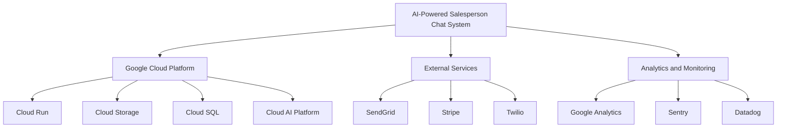

| Service | Purpose |
|---------|---------|
| Google Cloud Run | Serverless container deployment and scaling |
| Google Cloud Storage | Object storage for files and backups |
| Google Cloud SQL | Managed relational database service |
| Google Cloud AI Platform | Hosting and serving machine learning models |
| SendGrid | Transactional email service for notifications |
| Stripe | Payment processing for e-commerce functionality |
| Twilio | SMS notifications and two-factor authentication |
| Google Analytics | Web analytics for user behavior tracking |
| Sentry | Error tracking and performance monitoring |
| Datadog | Infrastructure and application monitoring |

This technology stack leverages modern, scalable, and efficient tools and services, with a focus on the Google Cloud ecosystem as requested. The combination of TypeScript and React for the frontend, Python and FastAPI for the backend, and Google Cloud services for infrastructure provides a robust foundation for building the AI-powered salesperson chat system. The selected frameworks, libraries, and third-party services offer a balance of performance, developer productivity, and scalability to meet the project's requirements.

# 9. SECURITY CONSIDERATIONS

## 9.1 AUTHENTICATION AND AUTHORIZATION

The AI-powered salesperson chat system will implement a robust authentication and authorization mechanism to ensure secure access and appropriate permissions for different user roles.

### 9.1.1 Authentication

The system will use Google Cloud Identity Platform for user authentication, providing a secure and scalable solution.

| Authentication Method | Description |
|-----------------------|-------------|
| Email/Password | Traditional login method with strong password requirements |
| Single Sign-On (SSO) | Integration with corporate identity providers using SAML 2.0 |
| Multi-Factor Authentication (MFA) | Mandatory for admin and sales representative accounts |
| OAuth 2.0 | For third-party integrations and API access |

### 9.1.2 Authorization

Role-Based Access Control (RBAC) will be implemented to manage user permissions effectively.

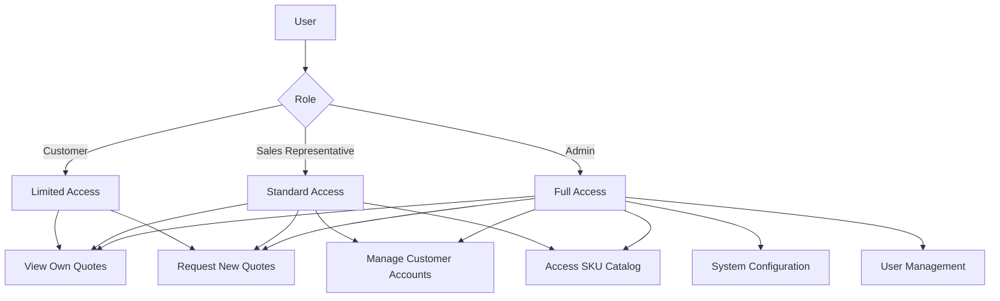

### 9.1.3 JWT Token Management

JSON Web Tokens (JWT) will be used for maintaining user sessions and API authentication.

- Token Lifetime: Access tokens will expire after 1 hour
- Refresh Tokens: Used to obtain new access tokens, with a 30-day expiry
- Token Storage: Securely stored in HTTP-only cookies to prevent XSS attacks

## 9.2 DATA SECURITY

Protecting sensitive information is crucial for maintaining trust and compliance with data protection regulations.

### 9.2.1 Encryption

| Data State | Encryption Method |
|------------|-------------------|
| Data at Rest | AES-256 encryption for all data stored in Google Cloud SQL and Cloud Storage |
| Data in Transit | TLS 1.3 for all network communications |
| Application-Level Encryption | Field-level encryption for highly sensitive data (e.g., payment information) |

### 9.2.2 Data Classification

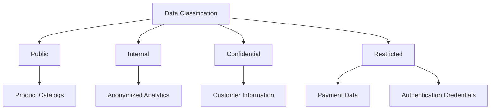

### 9.2.3 Data Retention and Disposal

- Implement automated data retention policies based on data classification
- Securely erase data using industry-standard methods when retention period expires
- Provide data export functionality for customers exercising their right to data portability

## 9.3 SECURITY PROTOCOLS

The following security protocols will be implemented to maintain a high level of system security:

### 9.3.1 Network Security

- Implement Web Application Firewall (WAF) using Google Cloud Armor
- Use Virtual Private Cloud (VPC) to isolate and protect cloud resources
- Enable DDoS protection through Google Cloud's infrastructure

### 9.3.2 Application Security

| Security Measure | Implementation |
|------------------|-----------------|
| Input Validation | Server-side validation using Python libraries (e.g., Pydantic) |
| Output Encoding | React's built-in XSS protection and additional encoding libraries |
| CSRF Protection | Use of anti-CSRF tokens in all forms |
| Content Security Policy (CSP) | Implement strict CSP headers to prevent XSS and other injection attacks |

### 9.3.3 Secure Development Lifecycle

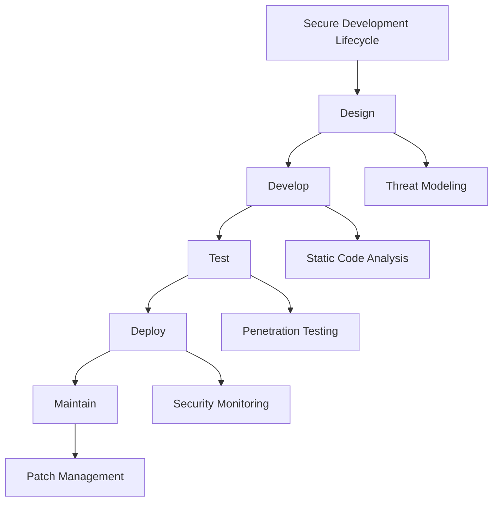

### 9.3.4 Incident Response Plan

1. Preparation: Establish an incident response team and procedures
2. Identification: Implement logging and monitoring to detect security incidents
3. Containment: Isolate affected systems to prevent further damage
4. Eradication: Remove the cause of the incident and restore systems
5. Recovery: Bring affected systems back online and verify normal operation
6. Lessons Learned: Conduct post-incident analysis and update security measures

### 9.3.5 Compliance and Auditing

- Conduct regular security audits and penetration tests
- Maintain compliance with relevant standards (e.g., GDPR, PCI DSS)
- Implement comprehensive logging and monitoring using Google Cloud's Operations suite
- Establish a bug bounty program to encourage responsible disclosure of security vulnerabilities

By implementing these security considerations, the AI-powered salesperson chat system will maintain a strong security posture, protecting sensitive data and ensuring the integrity of the system. The use of Google Cloud Platform's security features, combined with application-level security measures and best practices, provides a comprehensive approach to system security.